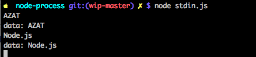

# Node Process Object

## Overview

By now you know that Node is different from browser JavaScript. Node's the server-side language after all. We can do all kinds of cool stuff on the server-side which is not allowed on the browser. For many reasons including security, browsers limit the access to the system information.

What if you want to pass some passwords to your app which is an open-source project? You cannot store passwords on GitHub. Duh! :-)

How about getting the system path of the current process to navigate to a particular folder? Or maybe your servers are overheating due to a bug (memory leaks are bad!), and you must get the stats before your server crashes leading to a frustrated boss and getting your fired from a job?

This lesson will cover the `process` global object in Node to get system information and manipulate the Node instance. Also, you can check memory, access passwords from environment variables, get current path and do many more things (exit the process, get versions and the type of the architecture of OS) by working with the `process` global object.

## Objectives

1. Describe the process objects
2. Describe about process information such as `versions`, `pid`, `cwd`, `features`, `uptime`, `memoryUsage`
3. Describe how to exit the process
4. Describe environment variables
5. Describe standard input and output

## Process Interface

`process` has a lengthy number of properties related to the currently running Node instance and the environment.

* `process.env`: Environment variables
* `process.pid`: Process ID, i.e., ID of the current process
* `process.platform`: Platform, e.g., `darwin`
* `process.cwd()`: Current working directory. Not always the same as `__dirname`.
* `process.version`: Version of node
* `process.versions`: Versions of node, V8, zlib and other Node internal components
* `process.features`: Features of this Node instance, e.g., `debug`p
* `process.arch`: Architecture of this system, e.g., `x64`
* `process.uptime()`: Time this process runs in seconds
* `process.memoryUsage()`: The heap total and used numbers

## Exiting The Process

It also has methods to terminate the process:

* `process.exit(1)`: Exit the current process with errors
* `process.exit(0)`: Exit the current process with no errors
* `process.kill(pid)`: Terminate a process by its ID `pid`, e.g., to kill self is `process.kill(process.pid)`

Note: the difference between `exit()` and `kill()` is that with the latter you can terminate any process and with the former only the current process.

If this was a mouthful of information, don't worry! You can always refer back to this lesson.

## Environment Variables

One of the important objects in the `process` object is `env`. It stands for environment variables or env vars for short. It's important, because we can pass certain information to our Node process(es) via env vars. Typically information like paths, modes (development or production) or configurations. Also, it's the way to pass sensitive information which we don't want to store in our source code such as usernames/passwords, API keys or information that is specific to that environment.

To access env vars, simply use `process.env.NAME` where `NAME` is a capitalized name of the environment variable. For example, `process.env.HOME` will give you a home path if it's set.

You can set env var in your bash/zsh profile on Macs and Linux, or in Control Panel on Windows. For example, this will append to `PATH` a Ruby env var, you can add this line to your bash profile:

```
export PATH="/usr/local/var/rbenv/shims:${PATH}"
```

Another and probably easier way is to prefix your `$ node program.js` command with the variables (or write a shell script with them). For example, we can use `-e` flag to output the `NODE_ENV` variable commonly used to set environment such as development, testing, and production:

```
NODE_ENV=production node -e "console.log(process.env.NODE_ENV)"
```

The command will output `production` and terminate. You can run a script instead of using `-e` and pass env vars before the node command. This method is better for variable specific only to your Node program because they won't persist as the profile settings would.

## Standard Input and Output

So how does our Node process communicate with the outside world besides the environment variables? Can we pass some data and get the Node script to output the results that we need?

Standard input `process.stdin` and output `process.stdout` are the answer. They are streams. Streams are this cool abstractions which allow us to process information (read or write) in chunks, i.e., without waiting for the whole information to finish loading. They are useful when there is no end (continuous operations) or when dealing with large data (e.g., videos, archives, images, huge datasets). 

Streams are a powerful concept and they are used a lot in Node, but it's not vital to fully understand them before starting using them. So don't worry. Right now, we want you to know that input and output are streams, what streams are and how to use them for `stdin` and `stdout`. We'll show you the input (`stdin`), which is a readable stream, later. For now let's focus on the output (`stdout`) which is a writable stream. Consider an example in which we output a string:

```js
process.stdout.write('Practical Node.js \n')
```

You might have guessed that using `process.stdout.write` is the exact same thing as `console.log`. In other words, `stdout` is the output of the Node program. But what about the input? How can you create a code generator which asks you some questions (what template engine to use?) to generate the boilerplate code? Or another command line tool?

We can use `stdin` which is an input to Node programs. Using it involve setting up event listeners `readable`. (The code for the `stdin` example is in the `stdin.js` file.)

```js
process.stdin.setEncoding('utf8')

process.stdin.on('readable', function() {
  var chunk = process.stdin.read()
  if (chunk !== null) {
    process.stdout.write(`data: ${chunk}`)
  }
})
```

So basically we are telling Node to wait for the event `readable` (`stdin` is something called readable stream). When this event happens, we read a chunk of data with the `read()` function. We echo the input back prefixing it with `data`. We also need another event listener `end`:

```js
process.stdin.on('end', function () {
  process.stdout.write('end')
})
```

This second event listener will fire on the pressing of the enter button. It will output the input back to the terminal.

Launch `node stdin.js` and watch what happens. When we run it, we can keep entering symbols in the terminal. Each time we press enter, the Node script will prefix the intupt with `data` and output it in the terminal:



## Resources

1. [Official Process Object Documentation](https://nodejs.org/api/process.html)
1. [The node.js process object video](https://egghead.io/lessons/node-js-the-node-js-process-object)
1. [Environment Variables on Windows](https://msdn.microsoft.com/en-us/library/windows/desktop/ms682653(v=vs.85).aspx)
2. [Node.js Process & Child Process video](https://www.youtube.com/watch?v=9o8B3L0-d9c)


---

<a href='https://learn.co/lessons/node-process' data-visibility='hidden'>View this lesson on Learn.co</a>
